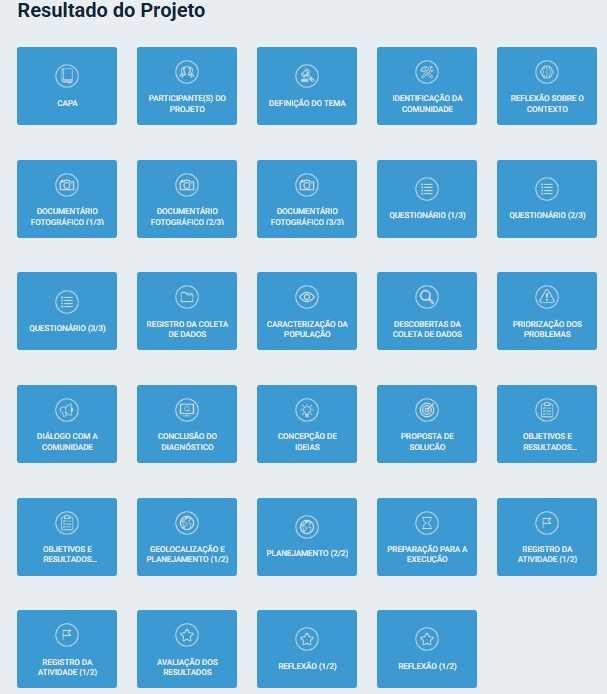

#UFBRA - Curso em Processos Gerenciais - ATIVIDADE EXTENSIONISTA (2025.NOV)

Aluno: Bruno Zolotareff dos Santos

## Projeto 
Inclusão socia e digital, orientado a cursos para formação profissional
 
## Quadro de tarefas preenchido
 

 
##Praça do Camilópolis em Santo André = Local inicial para aplicação do projeto.##
#Localização no Google Maps

 
##QR Code para o site do projeto e cursos

