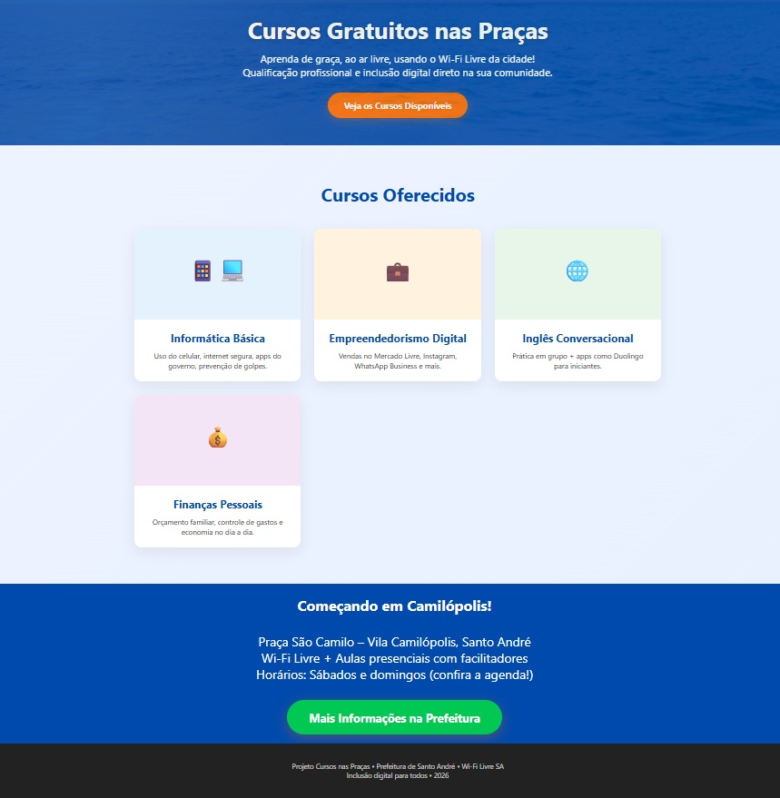
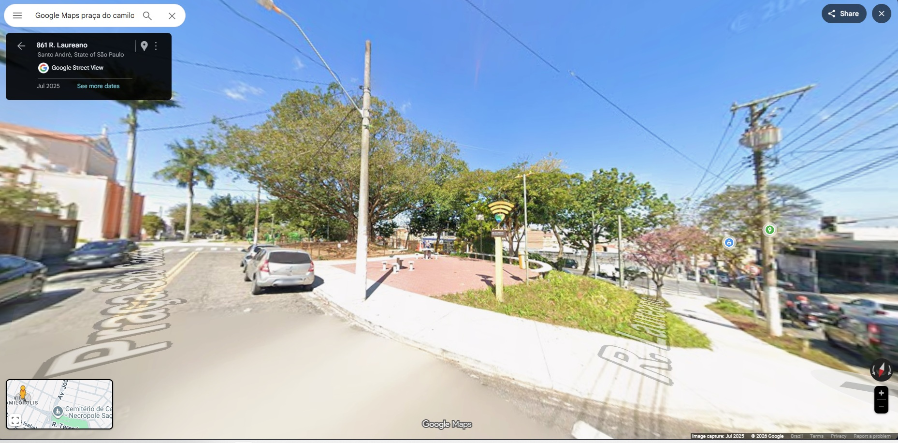
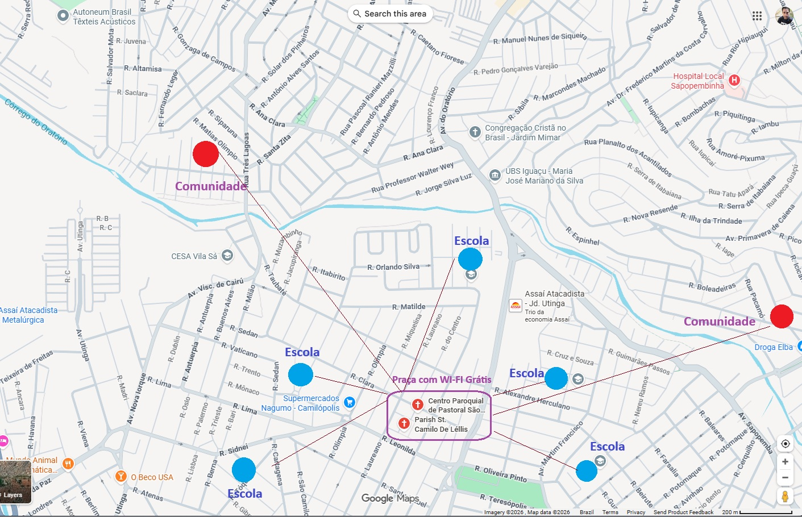

# UFBRA - Curso em Processos Gerenciais - ATIVIDADE EXTENSIONISTA (2025.NOV)

Aluno: Bruno Zolotareff dos Santos

## Projeto 
Inclusão socia e digital, orientado a cursos para formação profissional

Local inicial do projeto como modelo.
 
## Site do Projeto

# Link do site (Protótipo) - https://bzsantos.github.io/atividadeextensao/
 

 
## Praça do Camilópolis em Santo André - Local inicial para aplicação do projeto.
## Localização no Google Maps - Bairro Camilópolis em Santo André-SP.
- Link do local
https://maps.app.goo.gl/uyHCkYbQoBZHorWj7

 

# Pontos no bairro ou próximo do ponto de Wi-fi grátis para acesso aos cursos
- Vermelho: Comunidades
- Azul: Escolas

  

 
## QR Code para o site do projeto e cursos

